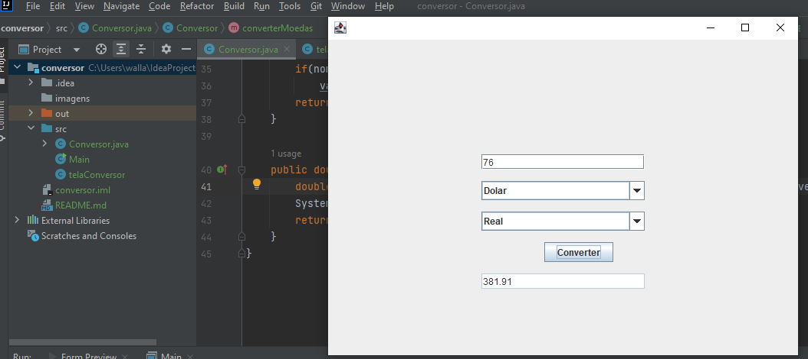

#  Sobre o Projeto:

Projeto de um conversor de moedas feito como desafio do "Challenge ONE". 

🔗 [Acesse aqui](https://wallacemod.github.io/challenge-codificador/)

### Suas funcionalidades são:
- Converter de Reais a Dólar
- Converter de Reais a Dólar
- Converter de Reais a Euro
- Converter de Reais a Libras Esterlinas
- Converter de Reais a Peso argentino
- Converter de Reais a Peso Chileno

### Requisitos:
- Deve funcionar de forma inversa

## 💻 Tecnologias:

- Java (Intellij)
- Swing

## 🚀 Atualizações planejadas: 

- Adição de uma aba "temperatura"
- Substituir Swing por JavaFX
- Consumir uma API para conversão de moedas